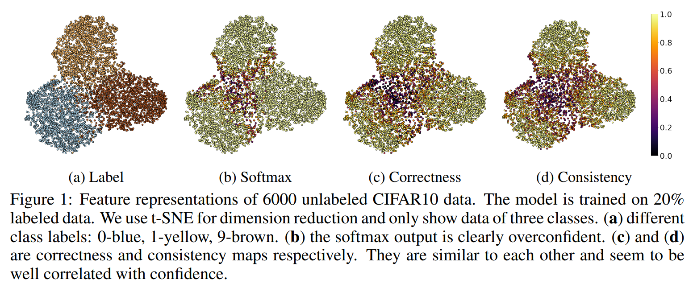

# consistency-ranking-loss
The code for ICLR2023 paper: [Confidence Estimation Using Unlabeled Data](https://openreview.net/forum?id=sOXU-PEJSgQ)  

Overconfidence is a common issue for deep neural networks, limiting their deployment in real-world applications. To better estimate confidence, existing methods mostly focus on fully-supervised scenarios and rely on training labels. In this paper, we propose the first confidence estimation method for a semi-supervised setting, when most training labels are unavailable. We stipulate that even with limited training labels, we can still reasonably approximate the confidence of model on unlabeled samples by inspecting the prediction consistency through the training process.  We use training consistency as a surrogate function and propose a consistency ranking loss for confidence estimation. On both image classification and segmentation tasks, our method achieves state-of-the-art performances in confidence estimation. Furthermore, we show the benefit of the proposed method through a downstream active learning task. 

 

### 1. Environment setup ###
Using conda:

conda env create -f consistency.yml

### 2. Training data for CIFAR10 ###
Both labeled and unlabeled data are available on [Google Drive](https://drive.google.com/file/d/1WpWVMyn8qEcKT77DIZAyMqcogJNhjVha/view?usp=sharing)  

### 3. Train and evaluate on CIFAR10 ###
Change the data location at lines in train_and_eval.py: 103, 108, 112

Run command: 

python train_and_eval.py --save_folder [Results saving folder] --gpus [GPU ID] --label_size [labeled samples size (2500, 5000, 10000)]

## ISIC2017 dataset ##

### 1. Environment setup ###

Using conda:

cd ISIC2017code/

conda env create -f consistency_test.yml

or

conda env create -f consistency.yml

pip install segmentation-models-pytorch==0.3.0

pip install scikit-image==0.19.2

### 2. Training data for ISIC2017 ###

move downloaded ISIC2017 dataset into [data_folder]

create [save_folder]

cd ISIC2017code/

python -W ignore ours_official.py --save_folder [save_folder] --gpus 2 --label_size 250 --con_weight 0.15 --data_folder [data_folder]

### 2. Evaluate for ISIC2017 ###

under folder ISIC2017code/

python eval_official.py --save_folder [save_folder] --gpus 2 --data_folder [data_folder] --file_name model_best.pth

### Citation ###
    @inproceedings{li2022confidence,
    author      =  {Li, Chen and Hu, Xiaoling and Chen, Chao},
    title       =  {Confidence Estimation Using Unlabeled Data},
    booktitle   =  {The Eleventh International Conference on Learning Representations (ICLR)},
    year        =  {2023}}
